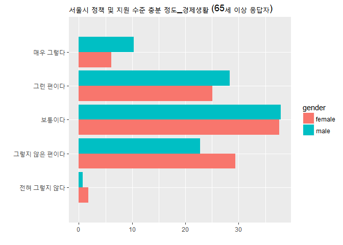
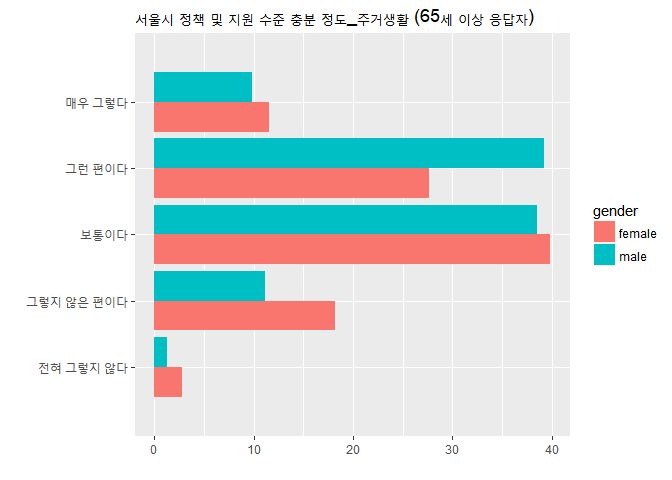
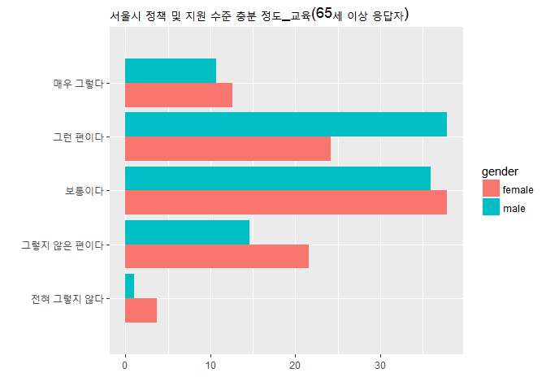
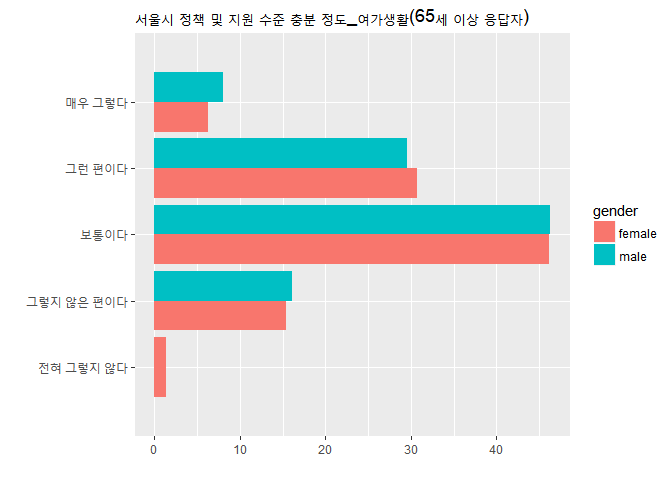
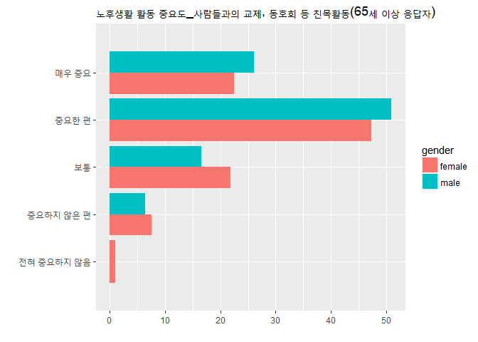
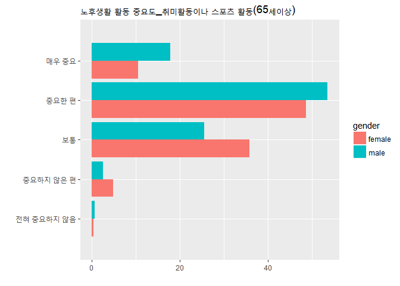
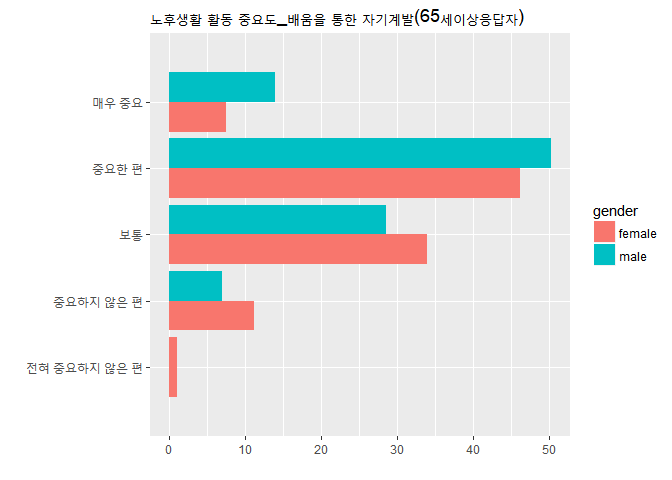
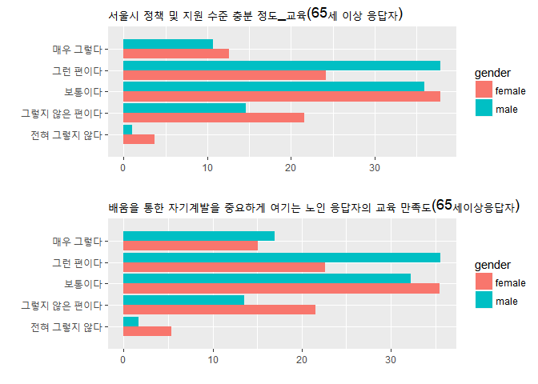

성별에 따른 노후생활 중요분야와 노인복지 만족정도
================

1. 요약(초록)
-------------

성별에 따라 바라는 노후생활과 현 정책 및 지원에 대한 만족도가 다르게 나타날 것이라고 생각했다. 여성과 남성을 나누고 성별에 따라 현재 노인 기준나이인 65세를 기준으로 노인과 노인이아닌 응답자를 나누어 집단별로 현 정책 및 지원수준에 대한 충분정도와 노후생활 활동 중요도를 분석하였다. 분석결과 현 정책 및 지원수준에 대한 전반적인 충분정도에 대해 여성노인의 경우 남성노인에 비해 만족하지 못하고 있다는 결론을 내릴 수 있었다. 이 결과는 65세 미만의 경우 만족하는 여성 비율이 남성비율에 비해 높은 것을 고려해 볼때 '여성노인복지'에 대한 논의가 필요하다고 해석할 수 있다.

2.분석 주제
-----------

**(1)문제 의식**

현재 한국 사회는 고령화가 가속화 되고 있다. 따라서 노인복지는 앞으로도 꾸준히 논의되어야 하는 주제라고 생각한다. 사회적으로 구조적인 문제가 존재하기에 성별에 따라 사회에 바라는 노인 복지형태, 또는 현 노인 복지에 대한 만족도가 다르게 나타나지 않을까하는 궁금증이 생겼다. 또한 삶의 방식이 달랐던 만큼 노년을 보내고 싶은 방식 또한 다를 것이라는 생각이 들었다.

**(2)알아보고자 하는 것**

노인층이 원하는 노인 복지형태와 현 정책 및 지원에 대한 만족도가 성별에 따라 다르게 나타나는지에 대해 알아보고자 한다.

3.데이터 소개
-------------

2015\_서울복지실태조사\_데이터를 사용하였다. 출처 : <http://data.si.re.kr/sisurvey2015er17>

서울복지실태조사 데이터는 서울연구원에서 2015년 당시 서울특별시에 거주하는 가구를 대상으로 구조화된 질문지를 통해 조사한 데이터이다. 주요 조사내용으로는 가구일반사항, 경제활동, 건강과 의료 이용, 가족생활, 여가 및 사회활동, 복지 서비스 이용, 복지의식 및 욕구가 있다.

4.분석
------

**기본 패키지 설치와 데이터 불러오기**

``` r
library(dplyr)
library(readxl)
library(ggplot2)
library(gridExtra)

df_data <- read_excel("raw_data.xlsx")
```

**필요한 변수 추출**

``` r
table(df_data$respondent) #설문 응답자의 가구원 번호 (1~6)
```

    ## 
    ##    1    2    3    4    5    6 
    ## 1574 1407   29    7    1    1

``` r
female <- df_data %>%
  filter(respondent==1 & A1_3_1==2 
         |respondent==2 & A1_3_2==2 
         |respondent==3 & A1_3_3==2
         |respondent==4 & A1_3_4==2
         |respondent==5 & A1_3_5==2
         |respondent==6 & A1_3_6==2)


dim(female) #응답자 중 여성의 수
```

    ## [1] 2202  828

``` r
male <- df_data %>%
  filter(respondent==1 & A1_3_1==1 
         |respondent==2 & A1_3_2==1 
         |respondent==3 & A1_3_3==1
         |respondent==4 & A1_3_4==1
         |respondent==5 & A1_3_5==1
         |respondent==6 & A1_3_6==1)

dim(male) #응답자 중 남성의 수 
```

    ## [1] 817 828

``` r
female_senior <- female %>%
  filter(respondent==1 & age_1>= 65
         |respondent==2 & age_2>=65
         |respondent==3 & age_3>=65
         |respondent==4 & age_4>=65
         |respondent==5 & age_5>=65
         |respondent==6 & age_6>=65)

dim(female_senior) #여성 응답자 중 노인의 수
```

    ## [1] 294 828

``` r
female_notsenior <- female %>%
  filter(respondent==1 & age_1< 65
         |respondent==2 & age_2<65
         |respondent==3 & age_3<65
         |respondent==4 & age_4<65
         |respondent==5 & age_5<65
         |respondent==6 & age_6<65)

dim(female_notsenior) #여성 응답자 중 노인이 아닌 수
```

    ## [1] 1908  828

``` r
male_senior <- male %>% 
  filter(respondent==1 & age_1>=65 
         |respondent==2 & age_2 >=65 
         |respondent==3 & age_3 >= 65 
         |respondent==4 & age_4 >=65 
         |respondent==5 & age_5 >= 65 
         |respondent==6 & age_6 >=65 )


dim(male_senior) #남성 응답자 중 노인의 수
```

    ## [1] 157 828

``` r
male_notsenior <- male %>%
  filter(respondent==1 & age_1< 65
         |respondent==2 & age_2<65
         |respondent==3 & age_3<65
         |respondent==4 & age_4<65
         |respondent==5 & age_5<65
         |respondent==6 & age_6<65)

dim(male_notsenior) #남성 응답자 중 노인이 아닌 수 
```

    ## [1] 660 828

**서울시 정책 및 지원 수준 충분 정도 \_ 경제생활(65세 이상 응답자)**

``` r
female_satisfaction_senior_1 <- female_senior %>%
  filter(!is.na(F4_1)) %>%
  group_by(F4_1) %>%
  summarise(ratio=n()/279*100)

male_satisfaction_senior_1 <- male_senior %>%
  filter(!is.na(F4_1)) %>%
  group_by(F4_1) %>%
  summarise(ratio=n()/145*100)

female_satisfaction_senior_1$gender<-c("female")
male_satisfaction_senior_1$gender<-c("male")

total_satisfaction_senior_1<-rbind(female_satisfaction_senior_1,male_satisfaction_senior_1)

ggplot(data=total_satisfaction_senior_1) +
  geom_bar(mapping = aes(x=F4_1,y=ratio, fill=as.factor(gender)),stat="identity", position = "dodge") + 
  scale_fill_discrete(name="gender")+ xlab('') + ylab('')+ coord_flip()+
  scale_x_discrete(limits = c("전혀 그렇지 않다","그렇지 않은 편이다","보통이다","그런 편이다","매우 그렇다"))+
  ggtitle("서울시 정책 및 지원 수준 충분 정도_경제생활 (65세 이상 응답자)")
```



**서울시 정책 및 지원 수준 충분 정도 \_ 고용과 노동 (65세 이상 응답자)**

``` r
####서울시 정책 및 지원 수준 충분 정도_고용과 노동 (65세 이상 응답자) ####

female_satisfaction_senior_2 <- female_senior %>%
  filter(!is.na(F4_2)) %>%
  group_by(F4_2) %>%
  summarise(ratio=n()/230*100)

male_satisfaction_senior_2 <- male_senior %>%
  filter(!is.na(F4_2)) %>%
  group_by(F4_2) %>%
  summarise(ratio=n()/141*100)


female_satisfaction_senior_2$gender<-c("female")
male_satisfaction_senior_2$gender<-c("male")


total_satisfaction_senior_2 <- rbind(female_satisfaction_senior_2,male_satisfaction_senior_2)

graph3<-ggplot(data=total_satisfaction_senior_2) +
  geom_bar(mapping = aes(x=F4_2,y=ratio, fill=as.factor(gender)),stat="identity", position = "dodge") + 
  scale_fill_discrete(name="gender")+ xlab('') + ylab('')+ coord_flip()+
  scale_x_discrete(limits = c("전혀 그렇지 않다","그렇지 않은 편이다","보통이다","그런 편이다","매우 그렇다"))+
  ggtitle("서울시 정책 및 지원 수준 충분 정도_고용과 노동 (65세 이상 응답자)")
ggplot(data=total_satisfaction_senior_2) +
  geom_bar(mapping = aes(x=F4_2,y=ratio, fill=as.factor(gender)),stat="identity", position = "dodge") + 
  scale_fill_discrete(name="gender")+ xlab('') + ylab('')+ coord_flip()+
  scale_x_discrete(limits = c("전혀 그렇지 않다","그렇지 않은 편이다","보통이다","그런 편이다","매우 그렇다"))+
  ggtitle("서울시 정책 및 지원 수준 충분 정도_고용과 노동 (65세 이상 응답자)")
```


**서울시 정책 및 지원 수준 충분 정도 \_ 주거생활 (65세 이상 응답자)**

``` r
####서울시 정책 및 지원 수준 충분 정도_주거생활 (65세 이상 응답자)####

female_satisfaction_senior_3 <- female_senior %>%
  filter(!is.na(F4_3)) %>%
  group_by(F4_3) %>%
  summarise(ratio=n()/286*100)

male_satisfaction_senior_3 <- male_senior %>%
  filter(!is.na(F4_3)) %>%
  group_by(F4_3) %>%
  summarise(ratio=n()/153*100)

female_satisfaction_senior_3$gender<-c("female")
male_satisfaction_senior_3$gender<-c("male")


total_satisfaction_senior_3 <- rbind(female_satisfaction_senior_3,male_satisfaction_senior_3)

ggplot(data=total_satisfaction_senior_3) +
  geom_bar(mapping = aes(x=F4_3,y=ratio, fill=as.factor(gender)),stat="identity", position = "dodge") + 
  scale_fill_discrete(name="gender")+ xlab('') + ylab('')+ coord_flip()+
  scale_x_discrete(limits = c("전혀 그렇지 않다","그렇지 않은 편이다","보통이다","그런 편이다","매우 그렇다"))+
  ggtitle("서울시 정책 및 지원 수준 충분 정도_주거생활 (65세 이상 응답자)")
```



**서울시 정책 및 지원 수준 충분 정도 \_ 교육 (65세 이상 응답자)**

``` r
####서울시 정책 및 지원 수준 충분 정도_교육 (65세 이상 응답자) ####

female_satisfaction_senior_6 <- female_senior %>%
  filter(!is.na(F4_6)) %>%
  group_by(F4_6) %>%
  summarise(ratio=n()/190*100)

male_satisfaction_senior_6 <- male_senior %>%
  filter(!is.na(F4_6)) %>%
  group_by(F4_6) %>%
  summarise(ratio=n()/103*100)

female_satisfaction_senior_6$gender<-c("female")
male_satisfaction_senior_6$gender<-c("male")

total_satisfaction_senior_6 <- rbind(female_satisfaction_senior_6,male_satisfaction_senior_6)

graph3<-ggplot(data=total_satisfaction_senior_6) +
  geom_bar(mapping = aes(x=F4_6,y=ratio, fill=as.factor(gender)),stat="identity", position = "dodge") + 
  scale_fill_discrete(name="gender")+ xlab('') + ylab('')+ coord_flip()+
  scale_x_discrete(limits = c("전혀 그렇지 않다","그렇지 않은 편이다","보통이다","그런 편이다","매우 그렇다"))+
  ggtitle("서울시 정책 및 지원 수준 충분 정도_교육(65세 이상 응답자)")
ggplot(data=total_satisfaction_senior_6) +
  geom_bar(mapping = aes(x=F4_6,y=ratio, fill=as.factor(gender)),stat="identity", position = "dodge") + 
  scale_fill_discrete(name="gender")+ xlab('') + ylab('')+ coord_flip()+
  scale_x_discrete(limits = c("전혀 그렇지 않다","그렇지 않은 편이다","보통이다","그런 편이다","매우 그렇다"))+
  ggtitle("서울시 정책 및 지원 수준 충분 정도_교육(65세 이상 응답자)")
```



**서울시 정책 및 지원 수준 충분 정도 \_ 여가생활 (65세 이상 응답자)**

``` r
####서울시 정책 및 지원 수준 충분 정도_여가생활 (노인층)####

female_satisfaction_senior_7 <- female_senior %>%
  filter(!is.na(F4_7)) %>%
  group_by(F4_7) %>%
  summarise(ratio=n()/286*100)

male_satisfaction_senior_7 <- male_senior %>%
  filter(!is.na(F4_7)) %>%
  group_by(F4_7) %>%
  summarise(ratio=n()/149*100)

female_satisfaction_senior_7$gender<-c("female")
male_satisfaction_senior_7$gender<-c("male")


total_satisfaction_senior_7 <- rbind(female_satisfaction_senior_7,male_satisfaction_senior_7)


ggplot(data=total_satisfaction_senior_7) +
  geom_bar(mapping = aes(x=F4_7,y=ratio, fill=as.factor(gender)),stat="identity", position = "dodge") + 
  scale_fill_discrete(name="gender")+ xlab('') + ylab('')+ coord_flip()+
  scale_x_discrete(limits = c("전혀 그렇지 않다","그렇지 않은 편이다","보통이다","그런 편이다","매우 그렇다"))+
  ggtitle("서울시 정책 및 지원 수준 충분 정도_여가생활(65세 이상 응답자)")
```



분석 결과, 여가생활을 제외한 경제, 고용과 노동, 주거생활, 교육면에서 '그렇지 않은 편이다(충분하지 않은 편이다)'에 남성노인에 비해 여성노인이 높은 비율로 응답했음을 알 수 있다. 특히 경제생활과 고용과 노동면에서는 서'그렇지 않은 편이다(충분하지 않은 편이다)'에 응답한 여성노인의 비율이 '그런 편이다(충분한 편이다)'에 응답한 여성노인의 비율보다 높은 것을 알 수 있다. 반면 '그런 편이다(충분한 편이다)'에는 여성노인에 비해 남성노인이 높은 비율로 응답했다.

**서울시 정책 및 지원 수준 충분 정도 \_ 전반적 지원 수준**

``` r
####서울시 정책 및 지원 수준 충분 정도_위의 사항을 모두 고려한 전반적 지원 수준 (65세 이상)####

female_satisfaction_senior_8 <- female_senior %>%
  filter(!is.na(F4_8)) %>%
  group_by(F4_8) %>%
  summarise(ratio=n()/291*100)

male_satisfaction_senior_8 <- male_senior %>%
  filter(!is.na(F4_8)) %>%
  group_by(F4_8) %>%
  summarise(ratio=n()/155*100)


female_satisfaction_senior_8$gender<-c("female")
male_satisfaction_senior_8$gender<-c("male")


total_satisfaction_senior_8 <- rbind(female_satisfaction_senior_8,male_satisfaction_senior_8)

graph1<-ggplot(data=total_satisfaction_senior_8) +
  geom_bar(mapping = aes(x=F4_8,y=ratio, fill=as.factor(gender)),stat="identity", position = "dodge") + 
  scale_fill_discrete(name="gender")+ xlab('') + ylab('')+ coord_flip()+
  scale_x_discrete(limits = c("전혀 그렇지 않다","그렇지 않은 편이다","보통이다","그런 편이다","매우 그렇다"))+
  ggtitle("서울시 정책 및 지원 수준 충분 정도_전반에 대한 만족도(65세 이상 응답자)")


####서울시 정책 및 지원 수준 충분 정도_위의 사항을 모두 고려한 전반적 지원 수준(65세 미만)####

female_satisfaction_notsenior_8 <- female_notsenior %>%
  filter(!is.na(F4_8)) %>%
  group_by(F4_8) %>%
  summarise(ratio=n()/1885*100)

male_satisfaction_notsenior_8 <- male_notsenior %>%
  filter(!is.na(F4_8)) %>%
  group_by(F4_8) %>%
  summarise(ratio=n()/651*100)


female_satisfaction_notsenior_8$gender<-c("female")
male_satisfaction_notsenior_8$gender<-c("male")


total_satisfaction_notsenior_8 <- rbind(female_satisfaction_notsenior_8,male_satisfaction_notsenior_8)


graph2<-ggplot(data=total_satisfaction_notsenior_8) +
  geom_bar(mapping = aes(x=F4_8,y=ratio, fill=as.factor(gender)),stat="identity", position = "dodge") + 
  scale_fill_discrete(name="gender")+ xlab('') + ylab('')+ coord_flip()+
  scale_x_discrete(limits = c("전혀 그렇지 않다","그렇지 않은 편이다","보통이다","그런 편이다","매우 그렇다"))+
  ggtitle("서울시 정책 및 지원 수준 충분 정도_전반에 대한 만족도(65세미만 응답자)")

grid.arrange(graph1, graph2, nrow=2)
```


결과적으로, 전반에 대한 만족도에서도 '그렇지 않은 편이다(충분하지 않은 편이다)' 항목에 남성노인에 비해 여성노인이 높은 비율로 응답했다. 그에 반해 65세 미만 응답자 분석 결과에해서는 전반에 대한 만족도에 대해 '그렇지 않은 편이다(충분하지 않은 편이다)'항목에 여성노인에 비해 남성노인이 높은 비율로 응답했다. 이는 성별이 서울시 정책 및 지원 수준 충분 정도에 단순요인으로 작용한다기 보다는 연령과 함께 복합적인 요인으로 작용한다는 것을 알 수 있다. 또한 남성노인에 비해 여성노인이 서울시복지수준에 대해 비교적 덜 만족하고 있음을 알 수 있다.

**노후생활 활동 중요도\_사람들과의 교제, 동호회 등 친목활동(65세 이상)**

``` r
####노후생활 활동 중요도_사람들과의 교제, 동호회 등 친목활동(65세 이상)####
female_important_senior_2 <- female_senior %>%
  filter(!is.na(F15_2)) %>%
  group_by(F15_2) %>%
  summarise(ratio=n()/294*100)

male_important_senior_2 <- male_senior %>%
  filter(!is.na(F15_2)) %>%
  group_by(F15_2) %>%
  summarise(ratio=n()/157*100)


female_important_senior_2$gender<-c("female")
male_important_senior_2$gender<-c("male")


total_important_senior_2 <- rbind(female_important_senior_2,male_important_senior_2)


ggplot(data=total_important_senior_2) +
  geom_bar(mapping = aes(x=F15_2,y=ratio, fill=as.factor(gender)),stat="identity", position = "dodge") + 
  scale_fill_discrete(name="gender")+ xlab('') + ylab('')+ coord_flip()+
  scale_x_discrete(limits = c("전혀 중요하지 않음","중요하지 않은 편","보통","중요한 편","매우 중요"))+
  ggtitle("노후생활 활동 중요도_사람들과의 교제, 동호회 등 친목활동(65세 이상 응답자)")
```



**노후생활 활동 중요도\_취미활동이나 스포츠 활동(65세 이상 응답자)**

``` r
####노후생활 활동 중요도_취미활동이나 스포츠 활동(노인층)####
female_important_senior_1 <- female_senior %>%
  filter(!is.na(F15_1)) %>%
  group_by(F15_1) %>%
  summarise(ratio=n()/294*100)

male_important_senior_1 <- male_senior %>%
  filter(!is.na(F15_1)) %>%
  group_by(F15_1) %>%
  summarise(ratio=n()/157*100)


female_important_senior_1$gender<-c("female")
male_important_senior_1$gender<-c("male")


total_important_senior_1 <- rbind(female_important_senior_1,male_important_senior_1)


ggplot(data=total_important_senior_1) +
  geom_bar(mapping = aes(x=F15_1,y=ratio, fill=as.factor(gender)),stat="identity", position = "dodge") + 
  scale_fill_discrete(name="gender")+ xlab('') + ylab('')+ coord_flip()+
  scale_x_discrete(limits = c("전혀 중요하지 않음","중요하지 않은 편","보통","중요한 편","매우 중요"))+
  ggtitle("노후생활 활동 중요도_취미활동이나 스포츠 활동(65세이상)")
```



**노후생활 활동 중요도\_취미활동이나 스포츠 활동(65세 이상 응답자)**

``` r
####노후생활 활동 중요도_건강이 허락하는 한 경제활동 참여(65세 이상 응답자)####

female_important_senior_3 <- female_senior %>%
  filter(!is.na(F15_3)) %>%
  group_by(F15_3) %>%
  summarise(ratio=n()/294*100)

male_important_senior_3 <- male_senior %>%
  filter(!is.na(F15_3)) %>%
  group_by(F15_3) %>%
  summarise(ratio=n()/157*100)


female_important_senior_3$gender<-c("female")
male_important_senior_3$gender<-c("male")


total_important_senior_3 <- rbind(female_important_senior_3,male_important_senior_3)


ggplot(data=total_important_senior_3) +
  geom_bar(mapping = aes(x=F15_3,y=ratio, fill=as.factor(gender)),stat="identity", position = "dodge") + 
  scale_fill_discrete(name="gender")+ xlab('') + ylab('')+ coord_flip()+
  scale_x_discrete(limits = c("전혀 중요하지 않은 편","중요하지 않은 편","보통","중요한 편","매우 중요"))+
  ggtitle("노후생활 활동 중요도_건강이 허락하는 한 경제활동 참여(65세이상 응답자)")
```


**노후생활 활동 중요도\_배움을 통한 자기계발(65세 이상 응답자)**

``` r
#####노후생활 활동 중요도_배움을 통한 자기계발(65세 이상 응답자)-완료####

female_important_senior_5 <- female_senior %>%
  filter(!is.na(F15_5)) %>%
  group_by(F15_5) %>%
  summarise(ratio=n()/294*100)

male_important_senior_5 <- male_senior %>%
  filter(!is.na(F15_5)) %>%
  group_by(F15_5) %>%
  summarise(ratio=n()/157*100)

female_important_senior_5$gender<-c("female")
male_important_senior_5$gender<-c("male")

total_important_senior_5 <- rbind(female_important_senior_5,male_important_senior_5)

ggplot(data=total_important_senior_5) +
  geom_bar(mapping = aes(x=F15_5,y=ratio, fill=as.factor(gender)),stat="identity", position = "dodge") + coord_flip()+
  scale_x_discrete(limits = c("전혀 중요하지 않은 편","중요하지 않은 편","보통","중요한 편","매우 중요"))+
  scale_fill_discrete(name="gender")+ xlab('') + ylab('')+ 
  ggtitle("노후생활 활동 중요도_배움을 통한 자기계발(65세이상응답자)")
```



대부분의 분야에서 '중요하지 않은 편'에 응답한 여성노인의 비율이 남성노인의 비율보다 높기는 하지만, 전체적인 분석을 살펴보면 대체로 성별에 관계없이 대부분의 분야를 중요하게 생각한다는 것을 알 수 있다. 여러 분야 중 배움을 통한 자기계발이 중요하다고 응답한 응답자들의 교육 만족도는 어느정도인지에 대해 궁금증이 생겨 추가로 분석해 보았다.

**배움을 통한 자기계발을 중요하게 여기는 노인 응답자의 교육 만족도**

``` r
femalesenior_1<- female_senior %>%
  filter(!is.na(F15_5) & !is.na(F4_6) & F15_5>=4) %>%
  group_by(F4_6) %>%
  summarise(ratio=n()/93*100) %>%
  arrange(desc(ratio))

malesenior_1<- male_senior %>%
  filter(!is.na(F15_5) & !is.na(F4_6) & F15_5>=4) %>%
  group_by(F4_6) %>%
  summarise(ratio=n()/59*100) %>%
  arrange(desc(ratio))

femalesenior_1$gender<-c("female")
malesenior_1$gender<-c("male")

totalesenior_1 <- rbind(femalesenior_1,malesenior_1)

graph4<-ggplot(data=totalesenior_1) +
  geom_bar(mapping = aes(x=F4_6,y=ratio, fill=as.factor(gender)),stat="identity", position = "dodge") + coord_flip()+
  scale_x_discrete(limits = c("전혀 그렇지 않다","그렇지 않은 편이다","보통이다","그런 편이다","매우 그렇다"))+
  scale_fill_discrete(name="gender")+ xlab('') + ylab('')+ 
  ggtitle("배움을 통한 자기계발을 중요하게 여기는 노인 응답자의 교육 만족도(65세이상응답자)")

grid.arrange(graph3, graph4, nrow=2)
```



분석 결과 두 그래프를 비교해보면 대체로 비슷한 양상을 띄고 있지만 '매우 그렇다(매우 만족한다)' 의 비율이 가장 눈에 띄게 증가한 것을 알 수 있다. 배움을 통한 자기계발을 중요하게 여길수록 교육에 매우 만족하는 비율이 증가함을 알 수 있고, 여성 응답자에 비해 남성응답자일수록 더 만족 효과가 크게 나타난다는 것을 알 수 있다.

5. 논의
-------

**(1)한계점, 비판점**

노인 응답자의 수가 적어 표본이 적다는 한계점이 있다. 또한 여성노인의 경우 왜 남성노인에 비해 만족하지 못하는지에 대한 이유를 밝혀내지 못했다는 비판을 받을 수 있다.

**(2)추후 분석 방향**

노인 응답자의 더 많은 표본과 다양한 변수들을 포함하는 데이터를 이용하여 노인 응답자의 표본이 더 많은 데이터를 사용하여 해당 노인들의 자녀의 특성(학력, 자산 등)에 따라 노인복지에 대한 만족도가 다르게 나타나는지에 대한 분석을 해 볼 수 있을 것 같다. 또한 여성 노인의 경우 본인의 자존감(경제활동능력, 학력, 사회활동능력)등에 따라 노인복지에 대한 만족도나 노후생활 주요분야가 영향을 받는지를 추가적으로 분석해 보면 좋을 것 같다.
